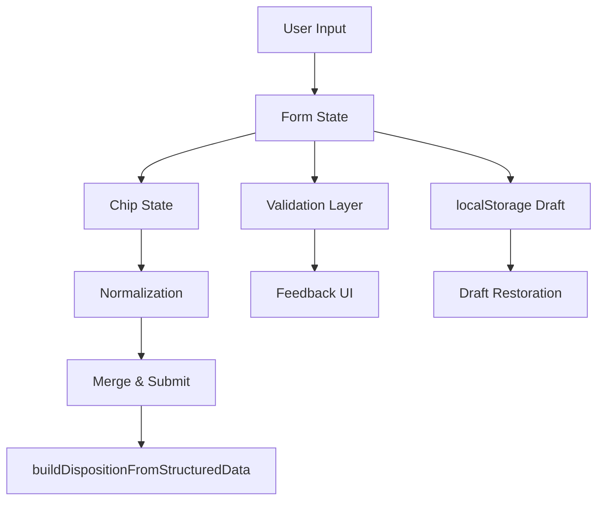

# Design Document: UX Improvements

## Overview

This design addresses critical usability issues in the PromptFormProfessional component that impact broker efficiency and text generation quality. The current implementation suffers from low text contrast (text-gray-400 on white backgrounds), confusing field duplicates (e.g., "Golvvärme" appears in both bathroom and heating sections), unclear field priority guidance, and suboptimal information architecture.

The solution implements a comprehensive UX overhaul focusing on:
- WCAG AA-compliant contrast ratios for all text elements
- Elimination of duplicate fields through canonical data representation
- Visual priority system with progressive disclosure
- Enhanced field grouping with clear information hierarchy
- Smart validation and contextual help
- Improved mobile responsiveness

The design maintains backward compatibility with the existing data pipeline (buildDispositionFromStructuredData in server/routes.ts) while significantly improving the user experience for Swedish real estate brokers.

## Architecture

### Component Structure

```
PromptFormProfessional (main component)
├── PriorityChecklist (new component)
│   ├── ChecklistItem
│   └── ProgressIndicator
├── FieldGroup (new component)
│   ├── GroupHeader
│   ├── GroupContent
│   └── FieldImpactBadge (new)
├── ChipSelector (enhanced)
│   ├── ChipButton
│   └── ChipTooltip (new)
├── NumberStepper (existing)
├── ValidationFeedback (new component)
└── FieldGuide (new sidebar component)
```

### State Management

The component uses React Hook Form for form state with additional local state for:
- Chip selections (10 separate arrays)
- UI expansion states (showDetails, field group collapse states)
- Draft persistence (localStorage)
- Validation state (inline feedback)
- Priority completion tracking

### Data Flow



### Design Token Updates

Current CSS variables in `client/src/index.css` require updates:

```css
:root {
  /* BEFORE */
  --muted-foreground: 216 12% 42%;  /* #6B7280 - insufficient contrast */
  
  /* AFTER */
  --muted-foreground: 216 12% 32%;  /* #4B5563 - WCAG AA compliant */
}
```

Tailwind utility classes to update:
- `text-gray-400` (#9CA3AF) → `text-gray-600` (#4B5563) for helper text
- `text-gray-500` (#6B7280) → `text-gray-700` (#374151) for labels
- `text-[10px]` → `text-xs` (12px) for priority checklist
- `text-[11px]` → `text-xs` (12px) for chip selectors

## Components and Interfaces

### 1. Enhanced ChipSelector Component

**Purpose**: Improve readability, accessibility, and visual feedback for chip-based selections.

**Interface**:
```typescript
interface ChipSelectorProps {
  chips: string[];
  selected: string[];
  onToggle: (chip: string) => void;
  variant?: ChipVariant;
  maxVisible?: number;  // NEW: for "Show more" functionality
  tooltips?: Record<string, string>;  // NEW: for contextual help
}

type ChipVariant = 
  | "default" | "kitchen" | "bathroom" | "flooring" 
  | "heating" | "special" | "garden" | "usp" 
  | "parking" | "roof" | "material";
```

**Changes**:
- Font size: `text-[11px]` → `text-xs` (12px)
- Add checkmark icon inside selected chips
- Implement keyboard navigation (Tab, Space)
- Add tooltips on hover with explanations
- Implement "Show more" for categories with >12 chips
- Increase touch targets on mobile: `py-1` → `py-2 px-3`

**Accessibility**:
- `role="checkbox"` for each chip
- `aria-checked` state
- `aria-label` with descriptive text
- Keyboard focus indicators

### 2. PriorityChecklist Component (New)

**Purpose**: Provide clear visual guidance on which fields are most important for quality text generation.

**Interface**:
```typescript
interface PriorityChecklistProps {
  items: PriorityItem[];
  onItemClick?: (fieldName: string) => void;  // Scroll to field
}

interface PriorityItem {
  label: string;
  completed: boolean;
  fieldName: string;
  priority: 'critical' | 'important' | 'optional';
}
```

**Visual Design**:
- Larger typography: `text-sm` instead of `text-xs`
- Three-tier visual system:
  - Critical: Red/orange accent (#F59E0B)
  - Important: Green accent (#10B981)
  - Optional: Gray accent (#6B7280)
- Progress indicator: "Grundläggande (0-40%)", "Bra (40-70%)", "Utmärkt (70-100%)"
- Pulsating indicator for empty priority fields
- Clickable items that scroll to and highlight corresponding fields

### 3. FieldGroup Component (New)

**Purpose**: Organize fields into logical sections with clear visual hierarchy and collapsible functionality.

**Interface**:
```typescript
interface FieldGroupProps {
  title: string;
  icon?: React.ReactNode;
  priority?: 'critical' | 'important' | 'optional';
  defaultExpanded?: boolean;
  persistKey?: string;  // localStorage key for expansion state
  children: React.ReactNode;
  helpText?: string;
}
```

**Groups**:
1. **Grundfakta** (Critical) - Address, area, size, rooms
2. **Försäljningsargument** (Critical) - USPs, view, special features
3. **Utrymmen** (Important) - Kitchen, bathroom, layout
4. **Material & Teknik** (Optional) - Flooring, heating, construction
5. **Läge & Omgivning** (Important) - Transport, neighborhood
6. **Övrigt** (Optional) - Energy class, storage, other info

**Visual Separators**:
- Increased spacing: `gap-4` → `gap-6` (1.5rem)
- Subtle background colors instead of borders
- Icons for each group (from lucide-react)
- Expansion state persisted in localStorage

### 4. FieldImpactBadge Component (New)

**Purpose**: Show users how each field affects the generated text output.

**Interface**:
```typescript
interface FieldImpactBadgeProps {
  impacts: TextImpact[];
  examples?: string[];
}

type TextImpact = 
  | 'huvudtext'      // Main property description
  | 'rubrik'         // Headline
  | 'socialt'        // Social media post
  | 'alla'           // All text types
  | 'metadata'       // Structured data only
  | 'juridiskt';     // Legal/factual sections
```

**Visual Design**:
- Small icon badge next to field label
- Color-coded by impact type
- Tooltip on hover with examples
- "Juridiskt" badge for fastighetsbeteckning, taxeringsvärde

### 5. ValidationFeedback Component (New)

**Purpose**: Provide immediate, contextual feedback on field input quality and errors.

**Interface**:
```typescript
interface ValidationFeedbackProps {
  field: string;
  value: any;
  rules: ValidationRule[];
  onSuggest?: (suggestion: string) => void;
}

interface ValidationRule {
  type: 'format' | 'required' | 'conflict' | 'quality';
  message: string;
  severity: 'error' | 'warning' | 'info';
  suggestion?: string;
}
```

**Features**:
- Inline validation for numeric fields (livingArea, price)
- Conflict detection (e.g., "Nyskick" + "Behöver renoveras")
- Quality indicator based on filled priority fields and text length
- Auto-save timestamp display
- Format suggestions (e.g., "Ange som: 84" for livingArea)

### 6. FieldGuide Component (New)

**Purpose**: Provide contextual help and best practices for each field.

**Interface**:
```typescript
interface FieldGuideProps {
  isOpen: boolean;
  onClose: () => void;
  currentField?: string;
}

interface FieldGuideContent {
  fieldName: string;
  title: string;
  description: string;
  examples: string[];
  bestPractices: string[];
  impact: TextImpact[];
}
```

**Implementation**:
- Slide-in sidebar (Sheet component from Radix UI)
- Searchable field list
- Auto-scroll to current field when opened
- Examples of good vs. bad input
- Links to related fields

## Data Models

### Form Data Structure

The existing `PropertyFormData` interface remains unchanged to maintain compatibility with the backend pipeline. All enhancements work with the existing structure.

### Chip Normalization

**Canonical Representation Rules**:
```typescript
const CANONICAL_RULES: Array<{ canonical: string; aliases: string[] }> = [
  {
    canonical: "Laddbox för elbil",
    aliases: ["laddplats elbil", "laddplats för elbil", "laddbox installerad", "laddbox"]
  },
  {
    canonical: "Nya fönster",
    aliases: ["fönster bytta", "nya fönster", "fönsterbyte"]
  },
  {
    canonical: "Stambyte genomfört",
    aliases: ["stambyte", "stamrenovering", "stambytt"]
  },
  {
    canonical: "Golvvärme",
    aliases: ["golvvärme", "vattenburen golvvärme"]
  }
];
```

**Duplicate Elimination Strategy**:
1. Remove "Golvvärme" from BATHROOM_CHIPS (keep only in HEATING_CHIPS)
2. Normalize all chip selections through aliasRules before merging
3. Detect and warn on chip/freetext conflicts
4. Consolidate renovation info into dedicated field

### Draft Persistence Schema

```typescript
interface FormDraft {
  timestamp: number;
  formData: PropertyFormData;
  chipSelections: {
    kitchen: string[];
    bathroom: string[];
    flooring: string[];
    heating: string[];
    special: string[];
    garden: string[];
    usp: string[];
    parking: string[];
    roof: string[];
    material: string[];
  };
  uiState: {
    expandedGroups: string[];
    hasBalcony: boolean;
    wordCountMin?: number;
    wordCountMax?: number;
  };
}
```

### Priority Calculation Logic

```typescript
function calculatePriorityCompletion(formData: PropertyFormData, chips: ChipSelections): PriorityStatus {
  const checks = [
    { label: "Adress", completed: Boolean(formData.address?.trim()), priority: 'critical' },
    { label: "Boarea", completed: Boolean(formData.livingArea?.trim()), priority: 'critical' },
    { label: "Rum och badrum", completed: Boolean(formData.totalRooms && formData.bathrooms), priority: 'critical' },
    { label: "Kök/badrum med fakta", completed: hasKitchenBathroomFacts(formData, chips), priority: 'important' },
    { label: "Kommunikation/läge", completed: hasLocationFacts(formData), priority: 'important' },
    { label: "Särskiljande styrkor", completed: hasStrongDifferentiator(formData, chips), priority: 'critical' },
    { label: "Planlösning/skick", completed: Boolean(formData.layoutDescription?.trim() || formData.condition?.trim()), priority: 'important' }
  ];
  
  const completed = checks.filter(c => c.completed).length;
  const total = checks.length;
  const percentage = (completed / total) * 100;
  
  return {
    checks,
    completed,
    total,
    percentage,
    level: percentage < 40 ? 'grundläggande' : percentage < 70 ? 'bra' : 'utmärkt'
  };
}
```


## Correctness Properties

*A property is a characteristic or behavior that should hold true across all valid executions of a system—essentially, a formal statement about what the system should do. Properties serve as the bridge between human-readable specifications and machine-verifiable correctness guarantees.*

### Property Reflection

After analyzing all acceptance criteria, I identified the following redundancies and consolidations:

**Redundancies Eliminated**:
- Requirements 7.5 and 11.1 both test auto-save every 10 seconds → Consolidated into Property 11
- Requirements 1.1, 1.2, 1.4 all test text contrast → Consolidated into Property 1
- Requirements 8.2 and 8.4 both test chip visual feedback → Combined into Property 8
- Requirements 9.3 and 9.4 both test mobile responsive behavior → Combined into Property 9

**Properties Combined**:
- Field impact indicators (5.1, 5.2, 5.3) → Single comprehensive property about impact badges
- Keyboard navigation and accessibility (8.5) subsumed by general accessibility property
- Multiple validation properties (7.1, 7.4) → Combined into comprehensive validation property

### Property 1: Text Contrast Compliance

*For any* text element in the form (labels, helper text, body text), the contrast ratio against its background SHALL be at least 4.5:1 for normal text and 3:1 for large text (18pt+) or interactive elements, meeting WCAG AA standards.

**Validates: Requirements 1.1, 1.2, 1.4, 1.5**

### Property 2: Chip Normalization

*For any* set of chip selections and freetext input, when the form is submitted, all overlapping or aliased values SHALL be normalized to their canonical representation according to aliasRules, with duplicates removed.

**Validates: Requirements 2.4, 2.5**

### Property 3: Priority Field Indicators

*For any* priority field that is empty, a visual indicator (pulsating dot or highlight) SHALL be displayed to draw user attention to incomplete critical fields.

**Validates: Requirements 3.2**

### Property 4: Priority Checklist Interaction

*For any* priority checklist item, when a user hovers over or clicks it, the form SHALL scroll to the corresponding field and apply a temporary highlight to indicate the field location.

**Validates: Requirements 3.4**

### Property 5: Progress Calculation

*For any* form state, the progress indicator SHALL accurately calculate completion percentage based on filled priority fields and display the correct level: "Grundläggande" (0-40%), "Bra" (40-70%), or "Utmärkt" (70-100%).

**Validates: Requirements 3.5**

### Property 6: Field Group Persistence

*For any* field group expansion state, when a user expands or collapses a group, that state SHALL be saved to localStorage and restored when the user returns to the form in a future session.

**Validates: Requirements 4.4**

### Property 7: Field Impact Badges

*For any* form field, an impact badge SHALL be displayed indicating which text outputs it affects (huvudtext, rubrik, socialt, alla, metadata, juridiskt), and hovering over the badge SHALL display a tooltip with examples of how the field is used.

**Validates: Requirements 5.1, 5.2, 5.3**

### Property 8: Chip Selector Overflow Handling

*For any* chip category with more than 8 chips, the chips SHALL be displayed in a scrollable container with max-height instead of wrapping, and categories with more than 12 chips SHALL show a "Visa fler" button to reveal additional options.

**Validates: Requirements 6.3, 8.6**

### Property 9: Numeric Field Validation

*For any* numeric field (livingArea, price, monthlyFee, etc.), when a user enters invalid or empty data and leaves the field, inline validation SHALL display with a specific error message and format suggestion.

**Validates: Requirements 7.1**

### Property 10: Quality Indicator Calculation

*For any* form state, the quality indicator SHALL be calculated based on three factors: (1) number of filled priority fields, (2) average text length in freetext fields, and (3) number of selected chips, and SHALL update in real-time as the user fills the form.

**Validates: Requirements 7.3**

### Property 11: Conflict Detection

*For any* pair of contradictory chip selections (e.g., "Nyskick" + "Behöver renoveras"), the form SHALL display a warning message indicating the conflict and suggesting the user review their selections.

**Validates: Requirements 7.4**

### Property 12: Auto-Save with Debouncing

*For any* form input change, the form data (including all chips and UI state) SHALL be saved to localStorage, with text field changes debounced by 500ms to avoid excessive saves, and a "Senast sparad" timestamp SHALL be displayed and updated after each save.

**Validates: Requirements 7.5, 11.1, 12.2**

### Property 13: Chip Visual Feedback

*For any* chip in any category, when selected it SHALL display a checkmark icon and use the category-specific color scheme, and when hovered it SHALL display a tooltip with additional information about what the option means.

**Validates: Requirements 8.2, 8.4**

### Property 14: Chip Keyboard Navigation

*For any* chip selector, users SHALL be able to navigate between chips using Tab key and toggle selection using Space key, with visible focus indicators showing the currently focused chip.

**Validates: Requirements 8.5**

### Property 15: Mobile Responsive Layout

*For any* viewport width less than 640px, the Priority_Checklist SHALL stack vertically with touch targets of at least 44px height, chips SHALL have increased padding (py-2 px-3), and less important field groups SHALL be collapsed by default.

**Validates: Requirements 9.1, 9.3, 9.4**

### Property 16: Mobile Floating Progress

*For any* scroll event on mobile viewports (width < 768px), a floating progress indicator SHALL be displayed showing the number of completed priority fields out of total priority fields.

**Validates: Requirements 9.5**

### Property 17: Contextual Help Triggers

*For any* field where the user enters data matching a help trigger pattern (e.g., filling kitchenDescription), a contextual tip SHALL appear suggesting additional information that would improve text quality.

**Validates: Requirements 10.2**

### Property 18: Field Group Help Icons

*For any* field group, a "?" help icon SHALL be present that, when clicked, opens a popover containing best practices, examples, and explanations specific to that group's fields.

**Validates: Requirements 10.4**

### Property 19: Idle Field Animation

*For any* important field that remains empty for 30 seconds while the user is active in the form, a subtle pulsating animation SHALL be applied to draw attention to the field.

**Validates: Requirements 10.5**

### Property 20: Draft Restoration Round-Trip

*For any* form state with data, when the user closes the browser tab and returns later, if saved draft data exists in localStorage, a "Återställ senaste utkast" banner SHALL be displayed, and clicking it SHALL restore all form fields, chip selections, and UI state to their previous values.

**Validates: Requirements 11.2**

### Property 21: API Failure Resilience

*For any* API call failure (address lookup, form submission), the form SHALL retain all user-entered data without loss, display an error message with details, and provide a "Försök igen" button to retry the operation.

**Validates: Requirements 11.3**

## Error Handling

### Validation Errors

**Strategy**: Inline validation with immediate feedback
- Numeric fields: Format validation on blur with suggestions
- Required fields: Validation on submit with scroll to first error
- Conflict detection: Real-time warnings as user selects conflicting options
- Quality warnings: Non-blocking suggestions to improve input

**Error Messages**: Swedish language, specific and actionable
- "Ange boarea som ett tal, t.ex. 84"
- "Adress krävs för att generera text"
- "Varning: 'Nyskick' och 'Behöver renoveras' motsäger varandra"

### API Errors

**Address Lookup Failures**:
```typescript
try {
  const result = await addressLookup(address);
  // Success path
} catch (error) {
  if (error.code === 'UPGRADE_REQUIRED') {
    toast({ 
      title: "Pro-funktion", 
      description: "Uppgradera till Pro för adressuppslag",
      variant: "destructive" 
    });
  } else {
    toast({ 
      title: "Kunde inte slå upp adress", 
      description: error.message,
      action: <Button onClick={retry}>Försök igen</Button>
    });
  }
}
```

**Form Submission Failures**:
- Preserve all form data in state
- Display error toast with retry button
- Log error to console for debugging
- Maintain draft in localStorage as backup

### LocalStorage Errors

**Quota Exceeded**:
```typescript
try {
  localStorage.setItem('optiprompt-form-draft', JSON.stringify(draft));
} catch (error) {
  if (error.name === 'QuotaExceededError') {
    // Clear old drafts, keep only latest
    clearOldDrafts();
    // Retry save
    localStorage.setItem('optiprompt-form-draft', JSON.stringify(draft));
  }
}
```

**Corrupted Data**:
```typescript
try {
  const draft = JSON.parse(localStorage.getItem('optiprompt-form-draft'));
  restoreDraft(draft);
} catch (error) {
  // Ignore corrupted drafts, start fresh
  console.warn('Corrupted draft data, starting fresh');
  localStorage.removeItem('optiprompt-form-draft');
}
```

### Accessibility Errors

**Focus Management**:
- Trap focus in modal dialogs
- Return focus to trigger element on close
- Provide skip links for keyboard users
- Announce dynamic content changes to screen readers

**ARIA Errors**:
- All interactive elements have accessible names
- Form errors announced via aria-live regions
- Invalid fields marked with aria-invalid
- Required fields marked with aria-required

## Testing Strategy

### Dual Testing Approach

This feature requires both unit tests and property-based tests for comprehensive coverage:

**Unit Tests** focus on:
- Specific UI configurations (e.g., CSS variable values, element positioning)
- Example cases (e.g., "Golvvärme" removed from BATHROOM_CHIPS)
- Integration points (e.g., localStorage persistence, API calls)
- Edge cases (e.g., empty form, all fields filled, conflicting selections)

**Property-Based Tests** focus on:
- Universal behaviors across all inputs (e.g., contrast ratios, normalization)
- State transitions (e.g., draft save/restore, field group expansion)
- Validation rules (e.g., numeric field validation, conflict detection)
- Responsive behavior (e.g., mobile layout changes at breakpoints)

### Property-Based Testing Configuration

**Library**: fast-check (JavaScript/TypeScript property-based testing)

**Configuration**:
```typescript
import fc from 'fast-check';

// Minimum 100 iterations per property test
fc.assert(
  fc.property(/* generators */, (/* inputs */) => {
    // Property assertion
  }),
  { numRuns: 100 }
);
```

**Test Tagging Format**:
```typescript
describe('PromptFormProfessional - UX Improvements', () => {
  // Feature: ux-improvements, Property 1: Text Contrast Compliance
  it('should maintain WCAG AA contrast ratios for all text elements', () => {
    fc.assert(
      fc.property(
        fc.record({
          textColor: fc.hexaString({ minLength: 6, maxLength: 6 }),
          backgroundColor: fc.hexaString({ minLength: 6, maxLength: 6 }),
          fontSize: fc.integer({ min: 10, max: 24 })
        }),
        ({ textColor, backgroundColor, fontSize }) => {
          const contrastRatio = calculateContrast(textColor, backgroundColor);
          const isLargeText = fontSize >= 18;
          const minRatio = isLargeText ? 3.0 : 4.5;
          return contrastRatio >= minRatio;
        }
      ),
      { numRuns: 100 }
    );
  });

  // Feature: ux-improvements, Property 2: Chip Normalization
  it('should normalize overlapping chip selections to canonical form', () => {
    fc.assert(
      fc.property(
        fc.array(fc.constantFrom(...ALL_CHIPS)),
        fc.string(),
        (selectedChips, freetextInput) => {
          const normalized = normalizeChipsAndText(selectedChips, freetextInput);
          // No duplicates in output
          const unique = new Set(normalized.split(', '));
          return unique.size === normalized.split(', ').length;
        }
      ),
      { numRuns: 100 }
    );
  });

  // Feature: ux-improvements, Property 20: Draft Restoration Round-Trip
  it('should restore all form state from localStorage draft', () => {
    fc.assert(
      fc.property(
        generateFormState(),
        (formState) => {
          // Save draft
          saveDraft(formState);
          // Clear form
          clearForm();
          // Restore draft
          const restored = restoreDraft();
          // Verify equality
          return deepEqual(formState, restored);
        }
      ),
      { numRuns: 100 }
    );
  });
});
```

### Unit Test Examples

**Contrast Ratio Tests**:
```typescript
describe('Text Contrast', () => {
  it('should use text-gray-600 for helper text', () => {
    render(<PromptFormProfessional {...props} />);
    const helperText = screen.getByText(/Prioritera skick/);
    const styles = window.getComputedStyle(helperText);
    expect(styles.color).toBe('rgb(75, 85, 99)'); // #4B5563
  });

  it('should update --muted-foreground CSS variable', () => {
    const root = document.documentElement;
    const mutedForeground = getComputedStyle(root).getPropertyValue('--muted-foreground');
    expect(mutedForeground.trim()).toBe('216 12% 32%');
  });
});
```

**Duplicate Elimination Tests**:
```typescript
describe('Chip Duplicates', () => {
  it('should remove Golvvärme from BATHROOM_CHIPS', () => {
    expect(BATHROOM_CHIPS).not.toContain('Golvvärme');
    expect(HEATING_CHIPS).toContain('Golvvärme');
  });

  it('should warn when chip and freetext contain same info', () => {
    const { getByText } = render(<PromptFormProfessional {...props} />);
    // Select "Laddbox för elbil" chip
    fireEvent.click(getByText('Laddbox för elbil'));
    // Enter same in freetext
    const input = screen.getByPlaceholderText(/Parkering/);
    fireEvent.change(input, { target: { value: 'Laddbox installerad' } });
    // Verify warning appears
    expect(screen.getByText(/samma information/i)).toBeInTheDocument();
  });
});
```

**Priority Checklist Tests**:
```typescript
describe('Priority Checklist', () => {
  it('should display with text-sm font size', () => {
    const { container } = render(<PromptFormProfessional {...props} />);
    const checklist = container.querySelector('[data-testid="priority-checklist"]');
    expect(checklist).toHaveClass('text-sm');
  });

  it('should scroll to field when checklist item clicked', async () => {
    const { getByText } = render(<PromptFormProfessional {...props} />);
    const scrollIntoViewMock = jest.fn();
    Element.prototype.scrollIntoView = scrollIntoViewMock;
    
    fireEvent.click(getByText('Adress'));
    
    await waitFor(() => {
      expect(scrollIntoViewMock).toHaveBeenCalled();
    });
  });

  it('should show confirmation dialog when submitting with <4 priority fields', () => {
    const { getByText } = render(<PromptFormProfessional {...props} />);
    // Fill only 3 priority fields
    fillField('address', 'Test address');
    fillField('livingArea', '84');
    fillField('totalRooms', '3');
    
    fireEvent.click(getByText('Generera textpaket'));
    
    expect(screen.getByText(/resultatet kan bli sämre/i)).toBeInTheDocument();
  });
});
```

**Mobile Responsive Tests**:
```typescript
describe('Mobile Responsiveness', () => {
  beforeEach(() => {
    // Set mobile viewport
    global.innerWidth = 375;
    global.innerHeight = 667;
  });

  it('should stack priority checklist vertically on mobile', () => {
    const { container } = render(<PromptFormProfessional {...props} />);
    const checklist = container.querySelector('[data-testid="priority-checklist"]');
    expect(checklist).toHaveClass('flex-col');
  });

  it('should use sticky positioning for submit button on mobile', () => {
    const { getByText } = render(<PromptFormProfessional {...props} />);
    const button = getByText('Generera textpaket');
    const styles = window.getComputedStyle(button.parentElement);
    expect(styles.position).toBe('sticky');
  });

  it('should increase chip padding on mobile', () => {
    const { container } = render(<PromptFormProfessional {...props} />);
    const chip = container.querySelector('[data-testid="chip"]');
    expect(chip).toHaveClass('py-2', 'px-3');
  });
});
```

### Test Coverage Goals

- **Unit Test Coverage**: >85% line coverage for component logic
- **Property Test Coverage**: All 21 properties implemented with 100+ iterations each
- **Integration Test Coverage**: Critical user flows (form fill → submit → draft restore)
- **Accessibility Test Coverage**: WCAG AA compliance verified with axe-core
- **Visual Regression**: Snapshot tests for key UI states (empty, partial, complete, mobile)

### Testing Tools

- **Unit Testing**: Vitest + React Testing Library
- **Property Testing**: fast-check
- **Accessibility**: @axe-core/react, jest-axe
- **Visual Regression**: Playwright with screenshot comparison
- **E2E Testing**: Playwright for critical user journeys

